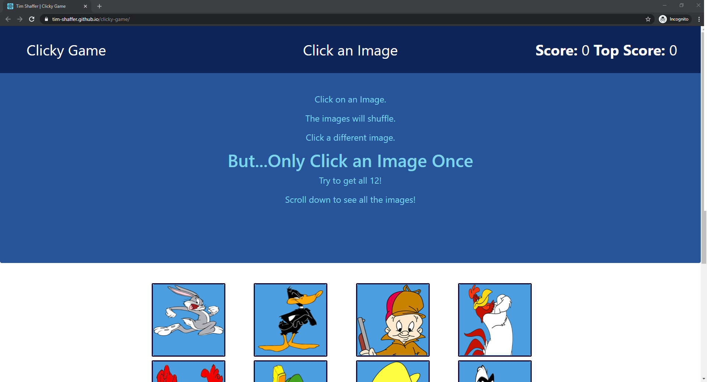
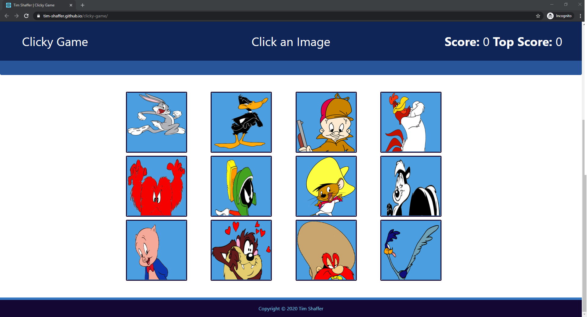
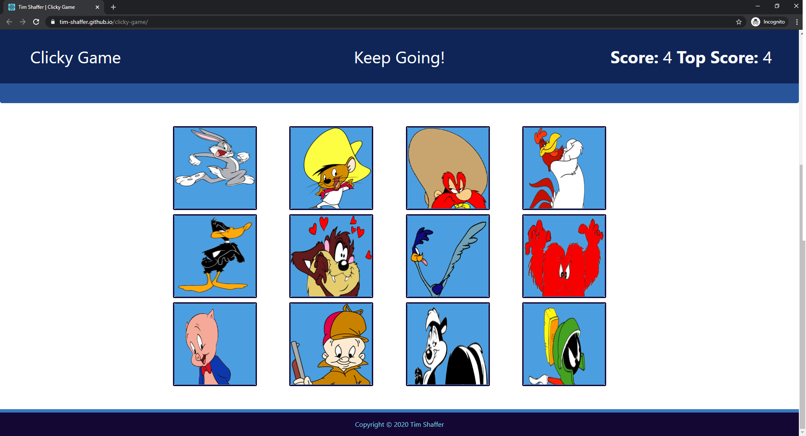
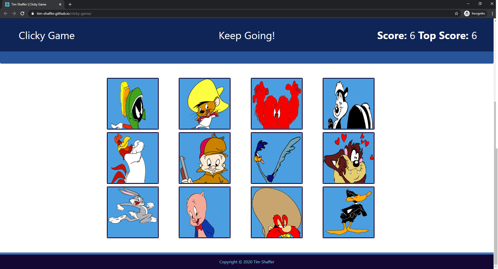
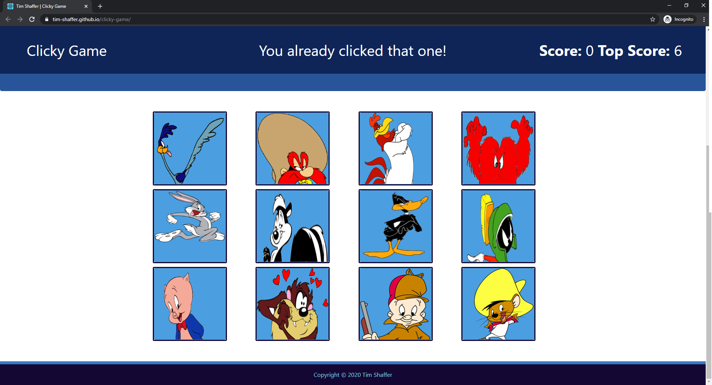
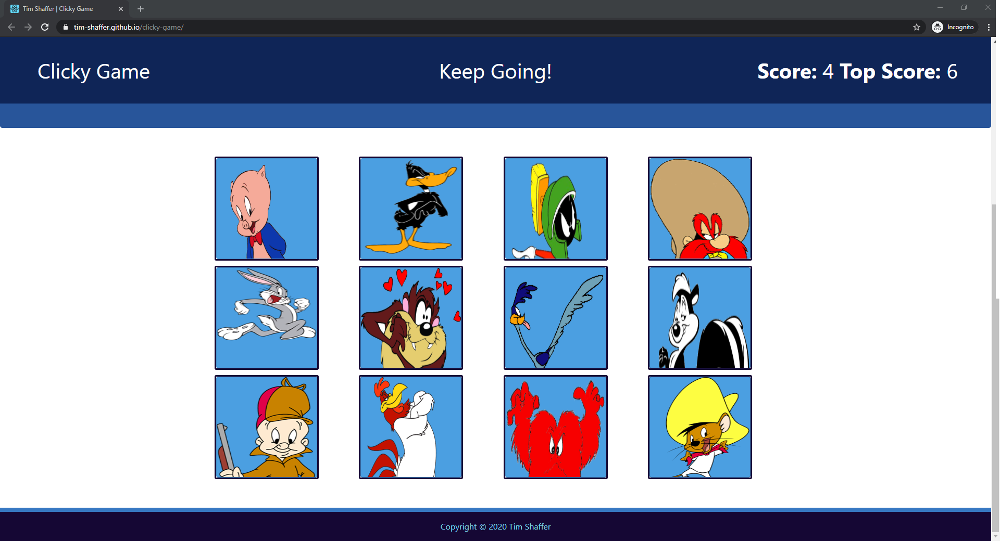
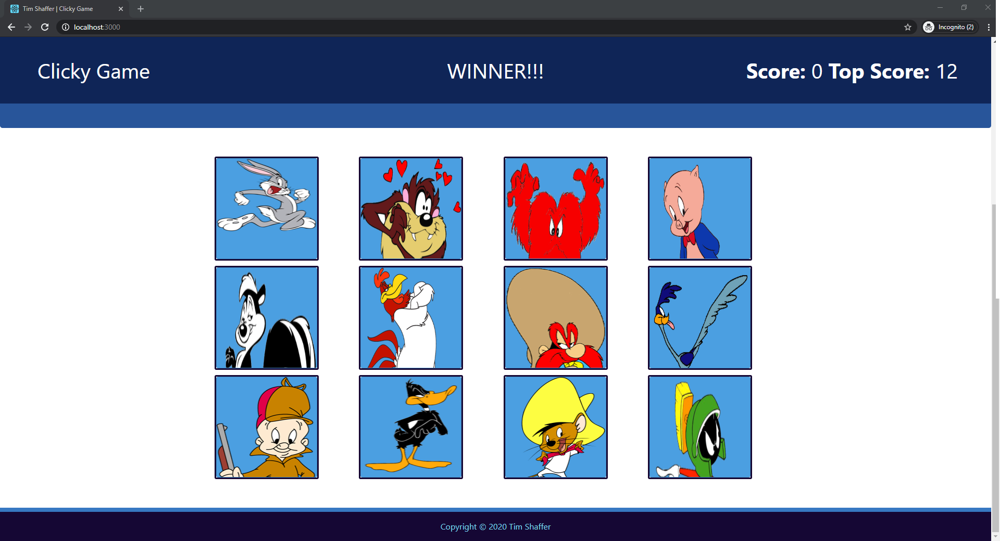

# clicky-game
A *React.js* memory game.

Twelve *Looney Tunes Characters* are displayed.  The object is to click each character image....**ONCE**!  It's not as easy as it sounds, as the images are re-arranged every time one of them is clicked.  If you can get through and select each one only once, you'll be the winner and hold the TopScore.  If you click on an image more than once, the scores will reset and you can try again.

# Author 
> Tim Shaffer

## Contents
* [Deployment](#deployment)
* [Tech Used](#tech-used)
* [File Structure](#folder-structure)
* [Instructions](#instructions)

## Deployment
The app is deployed to **Github Pages** at the following link:  https://tim-shaffer.github.io/clicky-game/

## Tech Used
* React.js 
* Node.js
    * gh-pages
* HTML 
* CSS
* Bootstrap

* This project was bootstrapped with [Create React App](https://github.com/facebook/create-react-app).
    * More information can be found in the `React-README.md`

### Folder Structure

```bash
📦clicky-game
┃  📦build
┃  📦node_modules
┃  📦public
┃  ┣ 📂assets
┃  ┃ ┗ 📂images
┃  ┃   ┣ 📜Bugs.png
┃  ┃   ┣ 📜Daffy.png
┃  ┃   ┣ 📜Elmer.png
┃  ┃   ┣ 📜Foghorn.png
┃  ┃   ┣ 📜Gossamer.png
┃  ┃   ┣ 📜Marvin.png
┃  ┃   ┣ 📜Pepe_Le_Pew.png
┃  ┃   ┣ 📜Porky.png
┃  ┃   ┣ 📜Roadrunner.png
┃  ┃   ┣ 📜Speedy.png
┃  ┃   ┣ 📜Taz.png
┃  ┃   ┗ 📜Yosemite_Same.gif
┃  ┣ 📜favicon.ico
┃  ┣ 📜index.html
┃  ┣ 📜logo192.png
┃  ┣ 📜logo512.png
┃  ┣ 📜manifest.json
┃  ┣ 📜robots.txt
┃  📦src
┃  ┣ 📂components
┃  ┣ 📂Card
┃  ┃ ┣ 📜index.js
┃  ┃ ┗ 📜style.css
┃  ┣ 📂Footer
┃  ┃ ┣ 📜index.js
┃  ┃ ┗ 📜style.css
┃  ┣ 📂Jumbotron
┃  ┃ ┣ 📜index.js
┃  ┃ ┗ 📜style.css
┃  ┣ 📂Navbar
┃  ┃ ┣ 📜index.js
┃  ┃ ┗ 📜style.css
┃  ┗ 📂Wrapper
┃  ┃ ┗ 📜index.js
┃  ┣📜App.js
┃  ┣ 📜App.test.js
┃  ┣ 📜images.json
┃  ┣📜index.css
┃  ┣ 📜index.js
┃  ┣📜logo.svg
┃  ┣📜serviceWorker.js
┃  ┗ 📜setupTests.js
┣ 📜.gitignore
┣ 📜package-lock.json
┣ 📜package.json
┣ 📜React-README.md
┣ 📜README.md
┗ 📜yarn.lock
```

# Instructions

1. Clicking the **Github Pages** link - https://tim-shaffer.github.io/clicky-game/ - will take you to the page.

    

1. Per the Instructions that are displayed... **Scroll Down to See All the Images**

    

1. Start the game by **Clicking an Image**. The Score will increment with each successful image clicked...and the images are re-arranged!

    

1. As the message says - **Keep Going!**. 

    

1. If you click an image a second time - **You already clicked that one** - is shown and the score reset. Top Score is maintained.   

    

1. Try Again!  Top Score will remain until a new top score is reached!  

    

1. If you are able to get all twelve - **WINNER!!!**.  The TopScore will now be 12...and you can try your luck again! 

    


